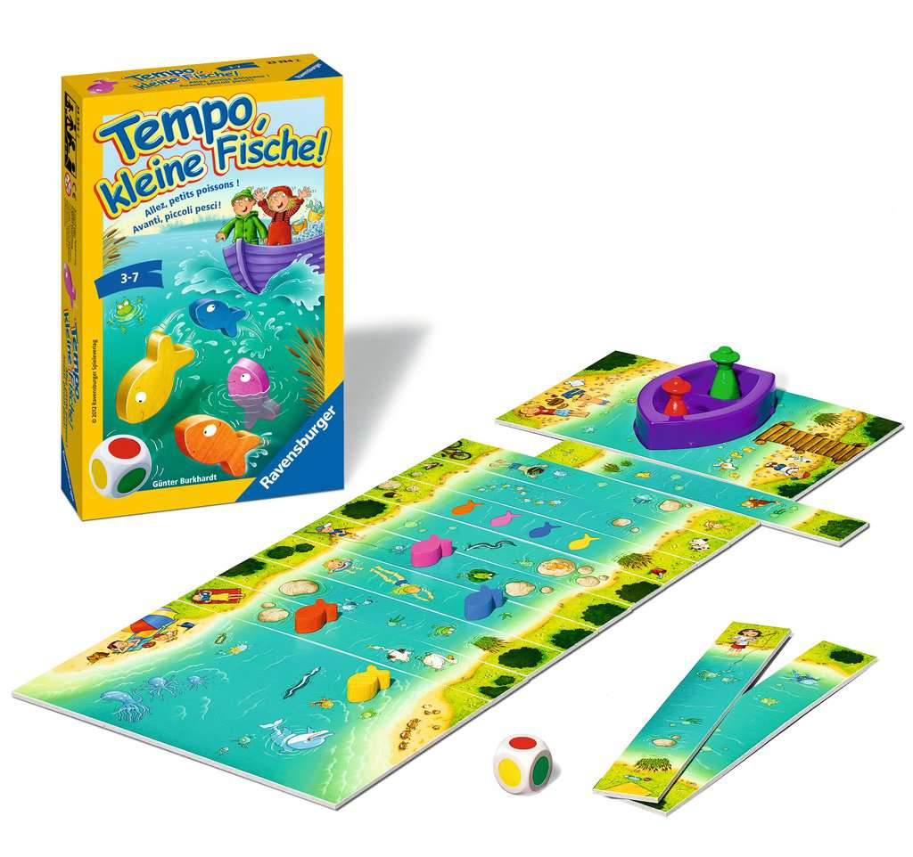

# "Tempo, Kleine Fische!" Simulator  


Pretty simple simulator for the famous "Tempo, kleine Fische" board game.



## Some interesting learnings from the simulator

*...and what to expect.*

If we simulate a great number of games, we can get some interesting stats:

* you should **always take the fishermen team**, they have 51.8% chance to win!
* an average game lasts **24.5 turns**
* fishes have 36.1% chance to win,  22.1% chance to have draw game
* there's barely a winning strategy for fishes, even when there is a choice
(when a fish has to move but has already reach the sea, you can choose to move anoter one).
Truth is, it will give you +0.1% more chance if you move the nearest fish from the sea...

## Running

No need to install extra packages. Just define the number of games you want to simulate (10,000 by default)

```sh
# windows
cd src
python kleine_fische.py
# linux
cd src
python3 kleine_fische.py
```

## Contributing & comments

I am a complete rookie in Python programming. **Comments or advices are very much welcome**.
