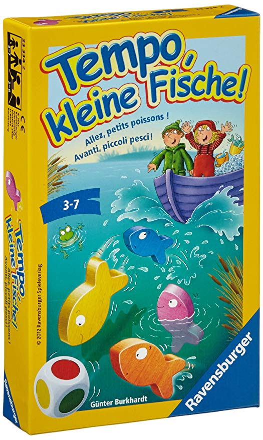

# "Tempo, Kleine Fische!" Simulator

Pretty simple simulator for the famous "Tempo, kleine Fische" board game.

## Some interesting learnings from the simulator

*...and what to expect.*

If we simulate a great number of games, we can get some interesting stats:

* you should **always take the fish team**, they have 70% chance to win!
* a average game lasts **24 turns**

## Running

No need to install extra packages. Just define the parameters you want

## Contributing & comments

I am a complete rookie in Python programming. **Comments or advices are very much welcome**.

