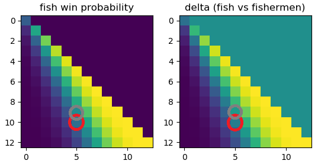

# "Tempo, Kleine Fische!" Simulator  


Pretty simple simulator for the famous "Tempo, kleine Fische" board game.


## Some interesting learnings from the simulator

*...and what to expect.*

If we simulate a great number of games, we can get some interesting stats:

* you should **always take the fishermen team**, they have **51.8%** chance to win!
* fishes have **36.1%** chance to win
* **22.1%** chance to have draw game
* an average game lasts **24.5 turns**
* there's no winning strategy for fishes, even when there is a choice
(when a fish has to move but has already reach the sea, you can choose to move anoter one).
Truth is, it will give you +0.1% more chance if you move the nearest fish from the sea...

We tried to change board size and fish position to know if we could get a more fair game :


*Vertical axis : board size -1. Horizontal axis : fish position -1. Red circle : real game. Grey circle : more fair game*

Game would be more fair to fish team if board size were 10 and fish position were 6 (instead of real game : board size = 11, fish position = 6)

## Running

You must have [Python installed](https://www.python.org/downloads/) (tested on Python 3.8 but should work with any version of Python)

Install packages :

```sh
# Windows
pip install -r requirements.txt
# linux
cd src
pip3 install -r requirements.txt
```

Run :

```sh
# Windows
python src/kleine_fische.py
# linux
python3 src/kleine_fische.py
```

You can also define the number of games you want to simulate by modifying the file - 10,000 games by default.

## Contributing & comments

I am a complete rookie in Python programming. **Comments or advices are very much welcome**.
